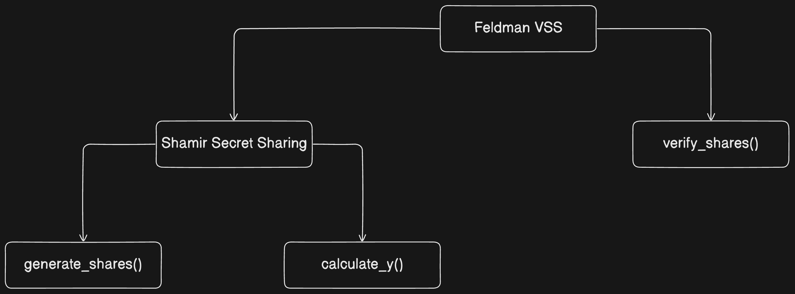

# Shamir's Secret Sharing and Feldman Verifiable Secret Sharing

This project implements **Shamir's Secret Sharing (SSS)** and **Feldman Verifiable Secret Sharing (VSS)** schemes in Rust. These cryptographic algorithms are used for secure and reliable sharing and reconstruction of secrets.

---

## Features

- **Shamir's Secret Sharing**:
  - Split a secret into multiple shares.
  - Specify a threshold number of shares required for reconstruction.
  - Supports modular arithmetic for secure operations.

- **Feldman Verifiable Secret Sharing**:
  - Provides verifiable commitment for each share.
  - Ensures that dishonest participants cannot forge invalid shares.
  - Uses a generator and commitments for validation.

- **Customizable Parameters**:
  - Specify the threshold, number of shares, and prime number for modular arithmetic.
  - Generate shares for small or large secrets.

## High level class diagram



## Installation
- **Clone the repository:**
```bash
git clone https://github.com/svssathvik7/secret_sharing.git
cd secret_sharing
```
- **Add dependencies to your** `Cargo.toml`: Make sure to include necessary `dependencies` in the `[dependencies]` section of your `Cargo.toml`:

```toml
[dependencies]
rand = "0.8"
num-bigint = "0.4"
num-traits = "0.2"
```